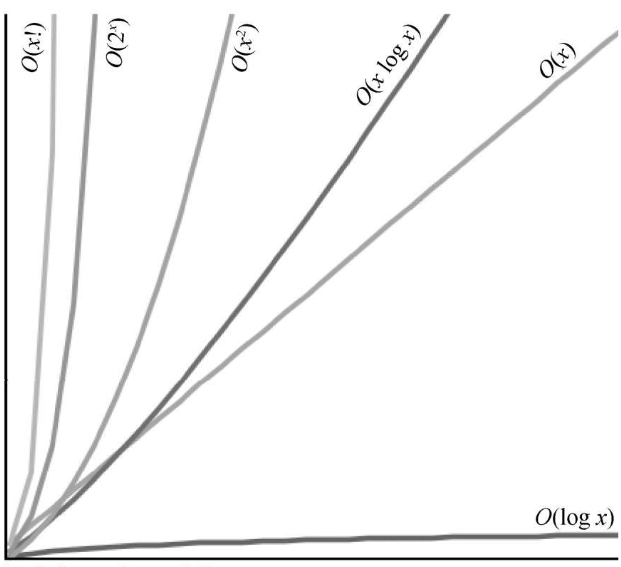
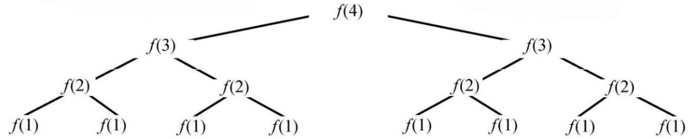

# 程序员面试金典

## 大 _O_

表示时间的大*O*符号，是用来描述算法效率的语言和度量单位。

### 时间复杂度

时间复杂度就是渐进运行时间或者大*O*时间。

常见运行时间的算法有：_O(logN)_、_O(NlogN)_、_O(N)_、_O(N2)_、_O(2N)_。但运行时间并不固定，远不止这些。

最优、最坏和期望情况是用来描述给定输入或场景中的大 O（或者学术界的大 θ）时间。

大 O、大 Ω 和大 θ 分别描述了运行时间的上界、下界和确界。

### 空间复杂度

时间并不是算法唯一要关心的东西，还得关心内存数量或空间大小。

空间复杂度和时间复杂度在概念上有些相像。如果要创建大小为 n 的数组，需要的空间为 _O(n)_。若是创建 n×n 的二维数组，需要的空间为 _O(n2)_。

### 删除常量

特定输入中，_O(N)_ 很有可能会比 _O(1)_ 代码还要快。大 _O_ 仅仅描述了增长的趋势。

因此，常量不算在运行时间中。例如某个 _O(2N)_ 的算法实际上是 _O(N)_。

### 丢弃不重要的项

应该舍弃无关紧要的项。

- _O(N2+N)_ 变成 _O(N2)_
- _O(N+logN)_ 变成 _O(N)_
- _O(5×2N+1000N100)_ 变成 _O(2N)_

尽管如此，有时还是需要用和的形式表示运行时间。例如，_O(B2)+A_ 就是最简化的形式了（除去 _A_、_B_ 特殊的几个值）。下面这幅图描述了几个常见大 O 的增长速率。

可以看到，O(x2)比 O(x)糟糕很多，但它比 O(2x)或者 O(x!)强太多了。还有很多比 O(x!)更糟糕的，比如 O(xx)或者 O(2 xx!)。

### 多项式算法：加与乘

假设你的算法有两步，如何区分加与乘呢？

- 如果你的算法是“做这个，结束之后做那个”的形式，就是加；（如，并列的循环）
- 如果你的算法是“对这个的每个元素做那个”的形式，就是乘。（如，嵌套的循环）

### 分摊时间

分摊时间描述了最坏情况会偶尔出现。一旦最坏情况发生了，就会有很长一段时间不再发生，也就是所说的时间成本的“分摊”。

分摊时间怎么计算呢？

> 假设数组大小为 2 的幂数，当插入一个元素时数组会扩容两倍。所以，当元素是 X 时，以 1, 2, 4, 8, 16, …,X 的数组大小成倍扩容。每次加倍操作需要复制 1, 2, 4, 8,16, …,X 个元素。 
> 1+2+4+8+16+…+X 的和是多少呢？如果从左往右算，就是从 1 开始一直乘以 2，直到等于 X；如果从右往左算，就是从 X 一直除以 2，直到等于 1。 
> 那么，X+X/2+X/4+X/8+…+1 的和等于多少呢？约等于 2X。 
> 因此，X 次插入需要 O(2X)的时间，即每次插入的分摊时间为 O(1)。

### _LogN_ 运行时间

二分查找法。总的运行时间从 _N_（ _N_ 每次减半）到 1 一共搜索多少次。也就是，从 1 开始每次乘以 2，多少次能得到 _N_ ?

也就是 2k = _N_ 中的 k，它的值是多少？它恰好符合 log 的语义。

- 24 = 16 -> log216 = 4；
- log2N = k -> 2k = N。

这是一个很好的推导方法。下次遇见类似的问题，元素格式也是每次减半，它的时间复杂度很可能是 _O(logN)_。

同类，在**平衡二叉搜索树**中查找一个元素也是 _O(logN)_。每次比较，非左即右。每边都有一半的节点，也就是说每次都把问题规模缩小一半。

### 递归的运行时间

通过模拟代码执行来推断出它的运行时间。假设调用 f(4)，它调用 f(3)两次，每个 f(3)都会调用 f(2)两次，以此类推直到 f(1)。

总共调用次数是多少呢？（不要数！）

如上图所示，树的高度为 N，每个节点有两个子节点。因此每一层节点数都是上一层节点数的两倍。下表展示了每层的节点数。

| 层  | 节点数 | 公式化表示                                         |   简单表示    |
| :-: | :----: | :------------------------------------------------- | :-----------: |
|  0  |   1    |                                                    | 20 |
|  1  |   2    | 2 x 上一层节点 = 2                                 | 21 |
|  2  |   4    | 2 x 上一层节点 = 2 x 21 = 22 | 22 |
|  3  |   8    | 2 x 上一层节点 = 2 x 22 = 23 | 23 |
|  4  |   16   | 2 x 上一层节点 = 2 x 23 = 24 | 24 |

因此，节点数为 20+21+22+23+24+…+2N=2N+1。

尽量记住这个模式。当一个多次调用自己的递归函数出现时，它的运行时间往往是（偶尔不是）O（分支数数的深度），分支数是每次调用自己的次数。所以，上面例子中运行时间是 O（2N）。

> log 的底数对大 O 来说并不重要，因为底数不同只代表常量系数不同。然而，这并不适用于指数。指数的基数很重要。比较 2n 和 8n，如果你展开 8n，得到 23n 等于 22n×2 n。正如你所见，8n 比 2n 多了一个因子 22n。这并不是一个常量系数。

这个例子的空间复杂度为 O(N)。尽管树节点总数为 O(2N)，但同一时刻只有 O(N)个节点存在。简而言之，只需要占用 O(N)的内存就可以了。

## 必须掌握基础知识

| 数据结构           | 算法         | 概念            |
| :----------------- | :----------- | :-------------- |
| 链表               | 广度优先搜索 | 位操作          |
| 树、单词查找树、图 | 深度优先搜索 | 内存（堆和栈）  |
| 栈和队列           | 二分查找     | 递归            |
| 堆                 | 归并排序     | 动态规划        |
| 向量/数组列表      | 快排         | 大 O 时间及空间 |
| 散列表             |              |                 |

务必掌握它们的具体用法、实现方法、应用场景以及空间和时间复杂度。
