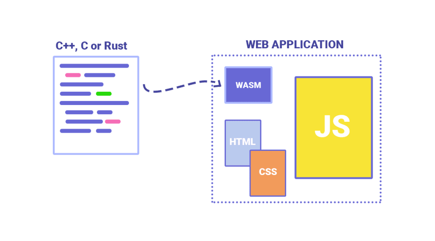
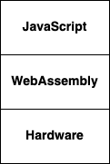
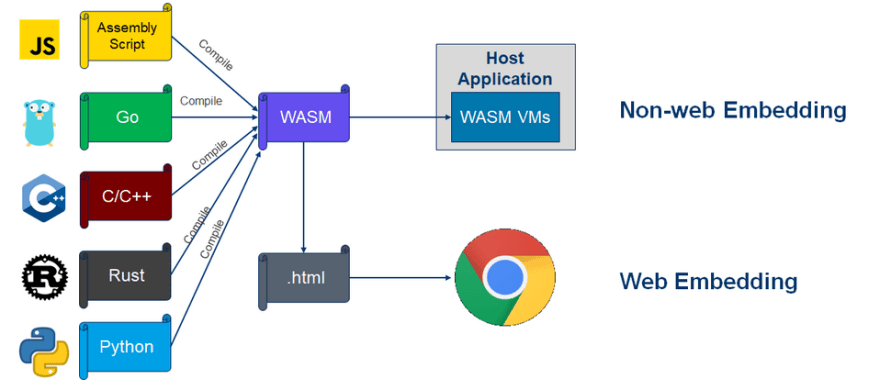

# 第一篇：使用 Gloang 和 Webassembly 构建一个聊天服务

- 外文地址：https://dev.to/taherfattahi/build-a-chat-service-using-golang-and-webassembly-part-1-1pee
- 作者：[Taher Fattahi](https://dev.to/taherfattahi)

## Webassembly 是什么?
简而言之，能在浏览器中编译和运行诸如 java，c#，python等语言的技术就是 `Webassembly`。

JavaScript是浏览器唯一能理解的编程语言。JavaScript经受住了时间的考验，它已经能够提供大多数Web应用程序所需的性能。但在3D游戏、VR、AR和图像编辑应用程序中，JavaScript还没有达到标准，因为它是解释型的。尽管像 `Gecko` 和 `V8` 这样的JavaScript引擎具有`Just in Time`编译功能，但JavaScript无法提供现代web应用程序所需的高性能。

WebAssembly(也称为wasm)就是用来解决这个问题的。

WebAssembly是浏览器的虚拟汇编语言。当我们说虚拟时，这意味着它不能在底层硬件上本地运行。因为浏览器可以运行在任何架构上，所以浏览器不可能直接在底层硬件上运行WebAssembly。但是，现代浏览器处理这种高度优化的虚拟汇编格式要比普通JavaScript快得多，因为它是经过编译的，而且比JavaScript更接近硬件架构。下图显示了与Javascript相比，WebAssembly在栈中的位置。它比JavaScript更接近硬件。

现有的JavaScript引擎支持运行WebAssembly的虚拟汇编代码。

WebAssembly并不是要取代JavaScript。它的本意是与JavaScript一起操作，以照顾到web应用程序的性能关键组件。可以从JavaScript调用WebAssembly，反之亦然。

WebAssembly通常不是手工编写的，而是由其他高级编程语言交叉编译而成。例如，可以交叉编译Go、C、c++和Rust代码到WebAssembly。因此，已经用其他编程语言编码的模块可以交叉编译为WebAssembly，并直接在浏览器中使用。

## WebAssembly (WASM)的应用
WebAssembly最初应该在哪里使用?首先，在任务中直接在浏览器中处理繁重的任务。

- 游戏开发
- 视频编辑/流处理
- 加密
- 图像识别

接下来在[第二篇](./part-2.md)中，我们将使用 golang 语言来编写首个WebAssembly代码。