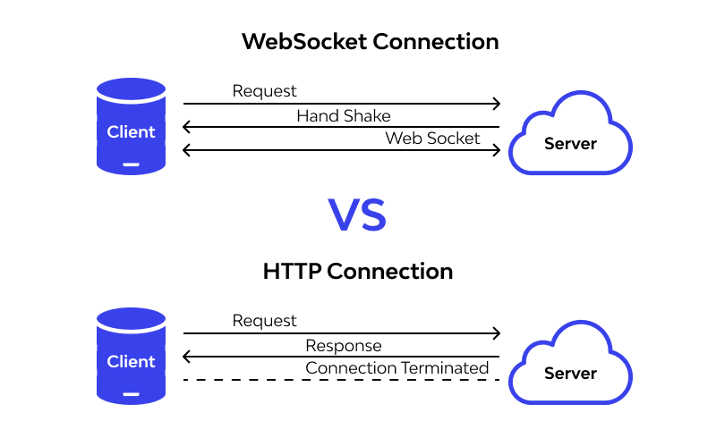

# 第三篇：使用 Gloang 和 Webassembly 构建一个聊天服务

- 外文地址：https://dev.to/taherfattahi/build-a-chat-service-using-golang-and-webassembly-part-3-1kn3
- 作者：[Taher Fattahi](https://dev.to/taherfattahi)

Gooood：)现在我们进入了第三篇--我们想谈谈聊天服务架构

聊天服务由两个主要部分组成：
- **聊天应用或者客户端部分**，它是桌面、Web或智能手机聊天应用程序。
- **聊天服务器引擎或服务器部分**，这是一个外部服务器池，负责聊天操作。这是所有聊天奇迹发生的地方。

这两个部分都包含各种组件，这些组件可以相互通信并将聊天付诸行动。

**聊天服务器引擎(Chat Server Engine)** 是聊天体系结构的核心，用于处理消息传递和分发。下面我想向你展示聊天服务的所有组件:

- `Chat REST API` 处理与消息分发和传递没有直接联系的任务，如用户认证、更改用户设置、好友邀请、下载贴纸包等。聊天应用程序(聊天客户端部分)通过 `Chat REST API` 客户端库与 `Chat REST API` 通信。

- `Chat WebSocket Server` 负责在用户之间传输消息。聊天应用程序通过 `Chat WebSocket Client Library` 与 `Chat WebSocket Server` 通信。这种连接是双向开放的;这意味着如果用户有任何消息，他们不需要向服务器发出请求，他们就能立即获得消息。

- `Chat Media Storage Server` 是一个服务器池，负责存储用户媒体文件。这些文件通过`Chat Media Storage Client Library` 上传。

**聊天应用程序(Chat App)** 是聊天架构的另一个主要部分，用户可以直接与之交互。它被分成三个独立的根组件:

- `Chat Client Engine` 通过它的内部组件处理与聊天服务器引擎的所有通信,其包括: `Chat REST API Client Library`，`Chat WebSocket Client Library` 和 `Chat Media Storage Client Library`。它还包括处理推送通知的 `Chat Push Message Handler` 处理程序。
- `Chat UI` 用户界面通过它的小部件向用户显示数据: **聊天联系人列表UI(Chat Contact List UI)，聊天对话框UI(Chat Dialog UI)，聊天推送消息小部件(Chat Push Message Widget)**(移动应用程序的扩展，允许在不打开应用程序的情况下回复消息)和**聊天内部通知小部件(Chat Internal Notification Widget)**(当用户在对话框中聊天时，一个弹出在屏幕顶部的小部件，并在另一个对话框中通知传入的消息)。
- `Chat Device Storage` 是一个内部数据库(读:设备存储)，它存储消息和文件，以便用户可以脱机访问它们。它的内部组件，聊天媒体缓存，从 `Chat Device Storage` 获取媒体文件，并将它们存储在设备上，以便用户可以随时访问它们，而不必每次访问聊天媒体存储。

因此，我们需要 `WebSocket` 协议来打开用户浏览器和服务器之间的双向交互通信会话。以便你可以向服务器发送消息并接收事件驱动的响应，而不必轮询服务器以获取应答。

在我们的项目中，我们用 `nodejs` 创建了一个websocket服务器，用`Golang`创建了一个websocket客户端。

文章引用：
1. [yellow.systems: Chat Service Architecture](https://yellow.systems/blog/guide-to-the-chat-architecture)
2. [developer.mozilla.org: WebSocket](https://developer.mozilla.org/en-US/docs/Web/API/WebSockets_API)

在[第四篇](./part-4.md)中，我们将使用 `nodejs` 来编写 websocket服务器。